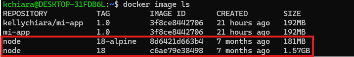
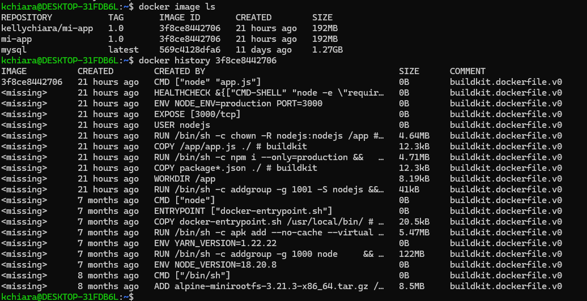

# Dockerizar Aplicación con Multi-Stage Build

## 1. Descripción de la aplicacion

**Lenguaje:** Node.js
**Framework:** Express
**Descripción:** API REST para gestión de usuarios

**Endpoints:**
- GET / - Mensaje de bienvenida
- GET /api/users - Lista de usuarios
- GET /api/users/:id - Obtención de usuario segun ID

**Funcionalidad:**
- Muestra un mensaje de bienvenida
- Extrae la lista de todos los usuarios registrados
- Extrae a un usuario por el ID

## 2. Dockerfile
- Se genera el archivo [Dockerfile](./Dockerfile)
```bash
# Stage 1: Build
FROM node:18-alpine AS build

# Establecer directorio de trabajo
WORKDIR /app

# Copiar archivos de dependencias
COPY package*.json ./

# Instalar todas las dependencias (incluyendo devDependencies)
RUN npm install

# Copiar el código de la aplicación
COPY . .

# Stage 2: Production
FROM node:18-alpine

# Crear usuario no-root para mayor seguridad
RUN addgroup -g 1001 -S nodejs && \
    adduser -S nodejs -u 1001

# Establecer directorio de trabajo
WORKDIR /app

# Copiar solo package.json y package-lock.json
COPY package*.json ./

# Instalar solo dependencias de producción
RUN npm i --only=production && \
    npm cache clean --force

# Copiar código desde stage de build
COPY --from=build /app/app.js ./

# Cambiar ownership de los archivos al usuario nodejs
RUN chown -R nodejs:nodejs /app

# Cambiar a usuario no-root
USER nodejs

# Exponer puerto
EXPOSE 3000

# Variables de entorno por defecto
ENV NODE_ENV=production \
    PORT=3000

# Health check
HEALTHCHECK --interval=30s --timeout=3s --start-period=5s --retries=3 \
  CMD node -e "require('http').get('http://localhost:3000/health', (r) => {process.exit(r.statusCode === 200 ? 0 : 1)})"

# Comando para iniciar la aplicación
CMD ["node", "app.js"]
```
- Tabla de instrucciones principales

| Instrucción | Descripción |
| :--- | :--- |
| FROM node:18-alpine AS build | Define la imagen base para la construcción, se utiliza alpine por ser ligera y se le asigna el alias build para referenciarla más adelante |
| RUN npm install | Instala todas las dependencias necesarias para compilar la aplicación |
| COPY . . | Copia el código fuente de la aplicación al directorio de trabajo dentro del contenedor |
| FROM node:18-alpine | Define la imagen base final para la ejecución. Se utiliza la misma base ligera, pero esta vez sin alias, asegurando que solo los archivos necesarios se incluyan |
| RUN adduser -S nodejs -u 1001 | Crea un usuario no-root llamado nodejs. Esto es una medida de seguridad para evitar que la aplicación se ejecute con privilegios de administrador |
| RUN npm i --only=production | Instala solo las dependencias de producción. Esto reduce el tamaño final de la imagen |
| COPY --from=build /app/app.js ./ | Copia el archivo app.js generado dejando fuera todas las dependencias de desarrollo y archivos innecesarios |
| EXPOSE 3000 | Documenta que la aplicación dentro del contenedor contiene el puerto 3000 |
| ENV NODE_ENV=production | Define variables de entorno, asegurando que la aplicación se ejecute en modo optimizado de producción |
| HEALTHCHECK ... | Configura una verificación periódica para determinar si la aplicación está funcionando correctamente |
| CMD ["node", "app.js"] | Es el comando final que se ejecuta al iniciar el contenedor para arrancar la aplicación |

## 3. Proceso Build y Testing local
- Creación de [.dockerignore](./.dockerignore)
- Construcción de la imagen
```bash
docker build -t mi-app:1.0 .
```


- Verificamos el tamaño
```bash
docker images mi-app
```


- Ejecutamos localmente
```bash
docker run -d -p 3000:3000 --name mi-app mi-app:1.0
```


- Verifiacamos logs
```bash
docker logs mi-app
```


## 4. Publicación en Docker Hub
- Hacer login en Docker Hub
```bash
docker login
```


- Tagear la imagen
```bash
docker tag mi-app:1.0 kellychiara/mi-app:1.0
```


- Push a Docker Hub
```bash
docker push kellychiara/mi-app:1.0
```


- Verificar en Docker Hub
>[kellychiara/mi-app](https://hub.docker.com/search?q=kellychiara%2Fmi-app)


## 5. Optimizaciones
- La principal optimización es la utilización de las versiones alpine


Como se puede visualizar la diferencia de tamaños es considerable
- Capas de la imagen
```bash
docker history 3f8ce8442706
```


## 7. Conclusiones
>La principal dificultad es comprender la correcta generación del archivo Dockerfile, ya que de esta depende la imagen a generar. Por lo tanto es la parte mas crucial para el funcionamiento de la generación de imagenes.
>>

>La generación y publicación de imagenes en dockerhub, para la reutilización del mismo, es impresionante. La manera en la que pasamos de la utilización a la generación de imagenes es un paso importante para profundizar los temas aprendidos en clase.
>>

>La principal diferencia con la primera clase es el paso de la utilización de una imagen a la generación de una, haciendola según nuestras necesidades y poder compartirlo con la comunidad que hace uso de dockerhub.
>>